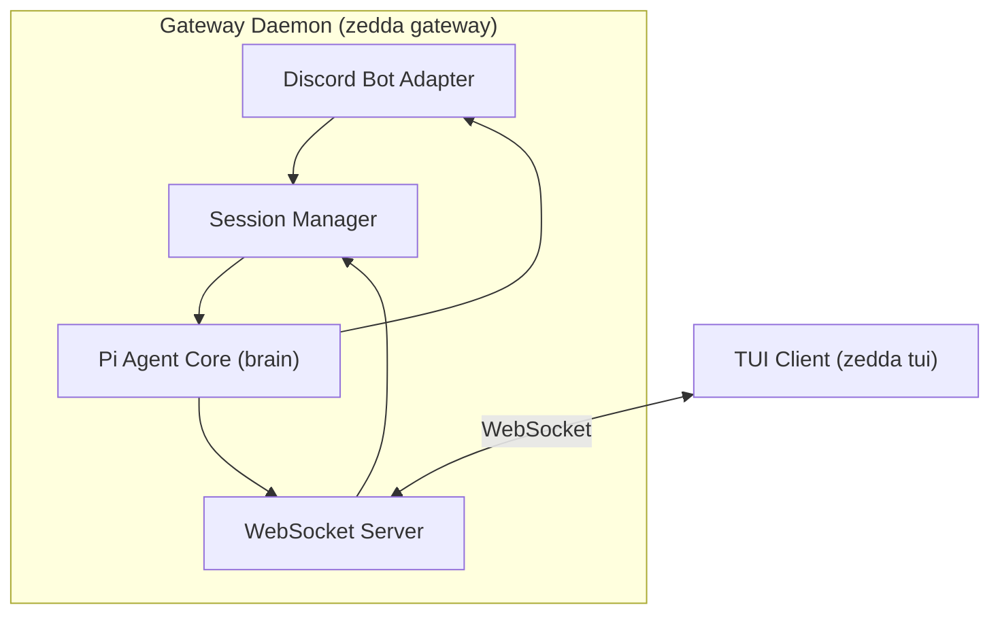

# zedda

> The hope is that, in not too many years, human brains and computing machines will be coupled together very tightly, and that the resulting partnership will think as no human brain has ever thought.
> 
> ~ J.C.R. Licklider, [Man-Computer Symbiosis](https://groups.csail.mit.edu/medg/people/psz/Licklider.html)

**zedda** is an agentic orchestration harness for running one's own AI symbiont. Heavily inspired by J.C.R. Licklider's seminal paper "[Man-Computer Symbiosis](https://groups.csail.mit.edu/medg/people/psz/Licklider.html)". Basically a gateway extension on top of the [Pi Agent SDK](https://github.com/earendil-works/pi) to hook up a core brain to different adapters (currently Discord and a local TUI client).

> [!CAUTION]
> **zedda** is highly in development and is a work in progress. I do not reccomend anyone besides me to actually use it.

## quick start
```bash
# git clone the repo
git clone https://github.com/rudyon/zedda.git
cd zedda

# install globally
npm install -g

# run the setup wizard
zedda setup

# start the gateway
zedda gateway run

# use the tui
zedda tui
```

## command reference

| Command | Description |
| --- | --- |
| `zedda setup` | Interactive setup wizard. |
| `zedda tui` | Interactive TUI chat with the symbiont. |
| `zedda gateway run` | Start the gateway in the foreground. |
| `zedda gateway restart` | Gracefully restart the running gateway. |
| `zedda --help` | Show usage help information. |

## architecture



## configuration

Edit `~/.zedda/config.toml` to change behavior:

```toml
[gateway]
port = 9332

[paths]
home = "~/.zedda"

[llm]
provider = "openrouter"
model = "deepseek/deepseek-v4-flash"

[adapters.discord]
enabled = true
allowed_users = [
  "012345678901234567"
]
primary_user = "012345678901234567"
```
