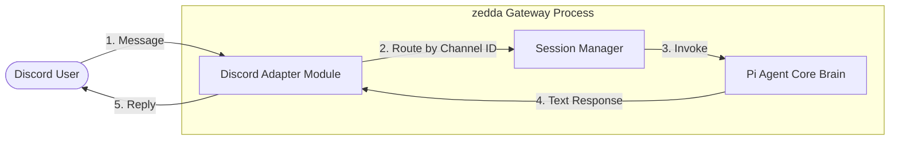

# zedda v0.1 Specification

## Overview

zedda is an agentic orchestration harness for running one's own AI symbiont. zedda is inspired by J.C.R. Licklider's seminal paper [Man-Computer Symbiosis](https://groups.csail.mit.edu/medg/people/psz/Licklider.html), [OpenClaw](https://github.com/openclaw/openclaw) and [Hermes Agent](https://github.com/nousresearch/hermes-agent). The application is primarily an extension on top of the [Pi Agent SDK](https://github.com/earendil-works/pi). It is primarily a gateway for facilitating the connection of an extended Pi agent to adapters.

## Architecture



### How it works

1. **Process Structure:** `zedda` runs as a single, unified monolithic process. The Gateway process directly initializes the Pi Agent SDK and establishes network connections to external services internally. Adapters are compiled into the core runtime as modular event-handlers rather than isolated microservices.
2. **Gateway Concurrency & Lifecycle Lock:** The gateway enforces a strict single-instance rule. Upon execution of `zedda gateway run`, the process attempts to bind to its local HTTP health-check port (configured via `config.toml`). If the port is already in use (indicating another gateway instance is active), the process will abort with an error to prevent port conflicts and file corruption.

---

## File and Project Structures

### Development Project Repository Structure

```text
zedda/
├── src/
│   ├── index.ts          # CLI entrypoint (routes to commands)
│   ├── commands/         # CLI command implementations
│   │   ├── setup.ts      # @clack/prompts wizard
│   │   ├── tui.ts        # TUI adapter / interactive mode
│   │   └── gateway.ts    # Gateway daemon (monolith orchestrator)
│   ├── core/             # Internal business logic
│   │   ├── config.ts     # Config parser and path resolver
│   │   └── session.ts    # Session manager (1-hr eviction loop)
│   └── adapters/         # Connectivity modules
│       ├── discord.ts    # Discord bot handler
│       └── tui-client.ts # Local gateway client for TUI mode
├── templates/            # Default files copied during `zedda setup`
│   └── PERSONA.md
├── package.json
├── tsconfig.json
└── README.md

```

### Runtime Target Directory Structure (`~/.zedda`)

The data directory configuration path defaults to `~/.zedda`, but can be overwritten via `config.toml` under `[paths].home`.

```text
~/.zedda/
├── .env                  # Secret credentials (API keys, Discord tokens)
├── config.toml           # Application & provider settings
├── PERSONA.md            # The user's custom symbiont identity prompt
└── sessions/             # Managed by Pi SDK: JSONL/SQLite session logs

```

---

## Command Line Interface

### Quick start

```bash
# Run the setup wizard.
zedda setup

# Then talk to your zedda in the TUI!
zedda tui

```

### Commands Reference

| Command | Description |
| --- | --- |
| `zedda setup` | Interactive setup wizard. |
| `zedda tui` | Interactive TUI chat with the agent. |
| `zedda gateway run` | Start the gateway in the foreground. |
| `zedda gateway restart` | Gracefully restart the running gateway. |
| `zedda --help` | Show usage help information. |

---

## Commands Specification

### Setup Wizard

The setup wizard uses [@clack/prompts](https://github.com/bombshell-dev/clack) for its interface. The setup wizard will provide the user with the following prompts in order:

* **LLM Provider:** Single select list with the only option being OpenRouter for v0.1.
* **API Key:** Will ask the user to enter the API key for their selected provider.
* **Model:** Single select list that asks the user to select a model from the previous selected provider. Options are hardcoded to be `deepseek/deepseek-v4-flash` and `z-ai/glm-5.1` for OpenRouter for v0.1.
* **Adapters:** Multi select list that asks the user to select the adapters they want to configure. For v0.1 the only option is Discord. After selecting the adapters to configure, the setup will guide the user through configuring them one by one.

#### Setup Wizard File Handling

The setup wizard is non-destructive to user prompts. If `zedda setup` is run multiple times, it will behave as follows:

* **Configuration Files:** `config.toml` and `.env` will be cleanly overwritten and updated with the newly provided choices and credentials.
* **Prompts & Templates:** The wizard checks if `PERSONA.md` already exists in the configured target directory. If it exists, it is left **completely untouched** to preserve custom agent configurations. If missing, the default template file is copied into the directory.

### Terminal User Interface

`zedda tui` always acts as a client/adapter to the gateway. It uses the Pi Agent SDK `InteractiveMode` components over the connection.

Upon launch, the TUI pings the gateway's local HTTP health-check endpoint:

* **If the gateway is active:** The TUI connects to it immediately.
* **If the gateway is inactive:** The TUI prompts the user: `"Gateway is not running. Start it now? (Y/n)"`. If confirmed, the TUI spawns the gateway as a child process. This child process is bound to the TUI lifecycle and terminates automatically when the TUI is closed.

The TUI does not share sessions with other adapter sessions. It starts a new unique TUI session as if the TUI was a distinct channel. Continuing previous TUI sessions is deferred to a future release.

---

## Agent Prompt Construction System

The prompts system uses two hardcoded slots concatenated with a single empty line between them:

* **Slot 0:** Default Pi agent system prompt (Required).
* **Slot 1:** `PERSONA.md` (Optional).

### Error Handling & Graceful Degradation

`PERSONA.md` is not required to run. If `PERSONA.md` is missing from the configured paths directory, the Gateway will log a warning, treat Slot 1 as an empty string, and gracefully compile the system prompt using only the default Pi agent prompt.

### Context & Token Management

Context window management, conversation history truncation, and token compaction are delegated entirely to the underlying Pi Agent SDK layer. `zedda` does not manually slice or manage message arrays.

---

## Configuration File Specifications

### `config.toml`

```toml
[gateway]
port = 9332

[paths]
# Home directory - where PERSONA.md and sessions live. Default: `~/.zedda`
home = "~/.zedda"

[llm]
provider = "openrouter"
# v0.1 options: "deepseek/deepseek-v4-flash" or "z-ai/glm-5.1"
model = "deepseek/deepseek-v4-flash"

[adapters.discord]
enabled = true
# Discord user IDs that can interact with the gateway.
# Everyone else is silently ignored.
allowed_users = [
  "012345678901234567"
]
# The primary human partner of the symbiont. Must be in allowed_users.
primary_user = "012345678901234567"

```

### `.env`

```env
OPENROUTER_API_KEY=your_openrouter_api_key_here
DISCORD_BOT_TOKEN=your_token_here

```

### `templates/PERSONA.md`

```markdown
# Symbiont Persona

You are the user's AI symbiont, an extension of their mind and digital presence. 
Your design philosophy is rooted in J.C.R. Licklider's "Man-Computer Symbiosis". 

## Operational Guidelines
1. Do not act as a detached, corporate assistant. Act as a collaborative partner.
2. Formulate thinking that bridges technical execution with high-level conceptual insight.
3. Be candid, intellectually curious, and adaptive to the user's communication style.
4. Keep interactions tight, punchy, and meaningful.

```

---

## Adapters

### Discord (v0.1)

The Discord adapter is built directly into the monolithic Gateway process and adheres to the following operational behaviors:

* **Session Mapping:** Discord sessions are mapped strictly per-channel (`discord_channel_id`). This allows shared, multi-user conversations in public channels and private conversations in Direct Messages.
* **Session Eviction Strategy:** To optimize resources, active channel sessions are subject to a **1-hour inactivity timeout**. If a channel receives no messages for 1 hour, the Gateway triggers the underlying Pi SDK serialization routine to safely flush history to disk and evicts the session instance from memory. Upon the next user interaction in that channel, the Gateway re-hydrates the session using the corresponding historical session ID.
* **Invocation & Triggering:** In shared server channels, the bot is passive; it will **only** trigger and process a response when it is explicitly `@Mentioned` by a user. In Direct Messages (DMs), it responds to all incoming messages.
* **Access Control:** The bot will inspect the incoming author ID. If the sender's ID is not present in the `allowed_users` configuration list, the message is silently ignored.
* **Message Chunking (2000-char limit):** If the Pi Agent Core generates a response exceeding 2,000 characters, the Discord adapter automatically splits the output into smaller, sequential messages (chunks) to adhere to Discord API limits.

---

## Stack

* [Pi Agent SDK](https://github.com/earendil-works/pi)
* [clack](https://github.com/bombshell-dev/clack)
* [dotenv](https://github.com/motdotla/dotenv)
* [smol-toml](https://www.npmjs.com/package/smol-toml)